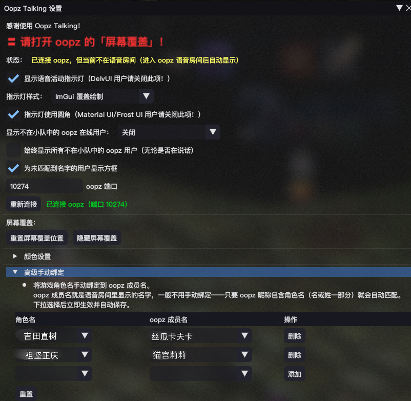

# Oopz Talking — FF14 小队列表显示 oopz 谁在说话

**改编自 [WhosTalking](https://codeberg.org/keysmashes/WhosTalking)（by keysmashes），把数据源从 Discord 换成 oopz**，游戏内绘制层（绿/蓝/黄框、未匹配名单、跨服/团队列表支持）原样保留。
**警告，本插件除原作者贡献代码外，100%代码为LLM生成**



数据不经过任何服务器：直连本机 oopz 客户端在 `127.0.0.1:10274` 暴露的 WebSocket，读 `{"cmd":"members","voice":true,"members":[{"name":"...","talking":true,"muted":false}]}` 成员流，每 1~2 秒刷新一次。只需 oopz 昵称包含游戏角色名（或手动绑定），就能在小队列表看到：

- 🟢 绿框 = 正在说话
- 🔵 蓝框 = 静音（oopz 成员流无"聋"状态，红色 Deafened 永不出现）
- 🟡 黄框 = 名字没对上（可在设置里关掉）
- 也可在列表下方显示"不在小队里但正在说话的人"

## 安装（库链）

在游戏里 **卫月设置 → 自定义插件库（Testing 库）**：

1. 添加自定义库链接：

```
https://raw.githubusercontent.com/Luckyumimi/MyDalamudPlugins/master/pluginmaster.json
```

3. 在 **已安装插件** 里搜索 **Oopz Talking**，点击安装
4. 启用后：进 oopz 语音房间 + FF14 小队，队友昵称与角色名一致即可立刻看到说话框。

> 也可以走研发模式手动加载本仓库 `release\` 下的 DLL（需同时存在同目录 `OopzTalking.json` 清单，且卫月开启"研发选项 → 开发插件路径"）。

## 使用

- `/oopztalking` —— 开关设置窗口
- `/oopztalking port 10274` —— 改 oopz 端口（默认已 10274）
- oopz 昵称包含角色名（第一个或最后一个字）即自动匹配；重名/花名可在设置「高级手动绑定」手动绑定

## 编译

需要 .NET SDK 和卫月 dev 目录（`%APPDATA%\XIVLauncher\addon\Hooks\dev` 或 `XIVLauncherCN` 的对应目录，内含 `Dalamud.dll`）：

```powershell
$env:DalamudLibPath = "$env:APPDATA\XIVLauncherCN\addon\Hooks\dev"
dotnet build OopzTalking.sln -c Release -p:DalamudLibPath="$env:DalamudLibPath"
# 产物：OopzTalking\bin\x64\Release\OopzTalking.dll + .json
```

## 开源协议 / License

本项目以 **GNU Affero General Public License v3.0（AGPL-3.0）** 开源，见 [LICENSE](LICENSE)。

## 鸣谢 / Credits

- **keysmashes** —— 原版 [WhosTalking](https://codeberg.org/keysmashes/WhosTalking) 的作者。本插件是其改编：把 Discord RPC 数据源替换为 oopz 本地 WebSocket，游戏内绘制层（说话/静音/未匹配方框、跨服与团队列表支持）沿用其实现。
- **Google Fonts Material Design icon library** —— 插件图标源自该图标库，依 [Apache License 2.0](https://www.apache.org/licenses/LICENSE-2.0) 使用。
- **oopz** —— 语音数据源（本机 `ws://127.0.0.1:10274`），非本项目开发内容。
